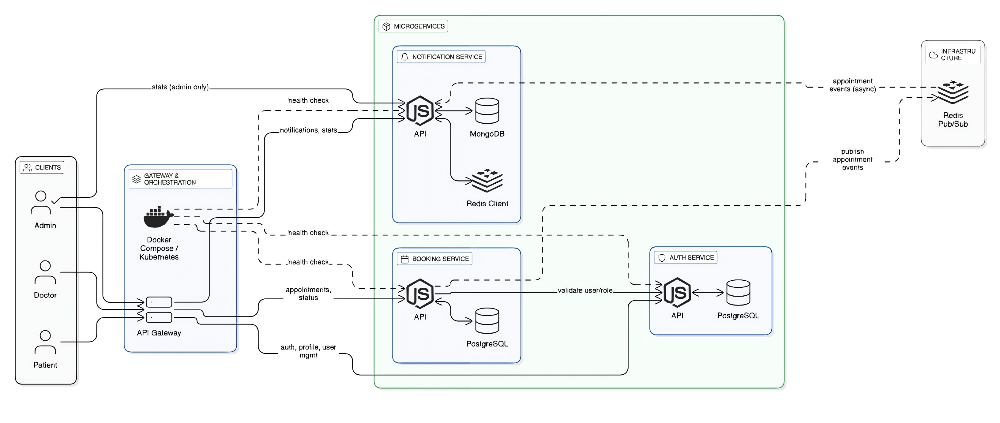

# Microservice Appointment Booking System

A robust, production-grade microservices-based appointment booking platform. This system is built for scalability, security, and maintainability, leveraging Node.js, Express, Prisma, MongoDB, Redis, and Docker.

---

## System Design Diagram



The system design diagram shows the relationships and interactions between the components of the Microservice Appointment Booking System. The diagram consists of the following components:

- **Nginx**: Used as a reverse proxy for the API Gateway.
- **Auth Service**: Handles user authentication and authorization.
- **Booking Service**: Handles appointment booking, management, and status tracking.
- **Notification Service**: Handles asynchronous notification of appointments to doctors and patients.
- **MongoDB**: Stores data for the Notification Service.
- **Redis**: Used as a message broker for the Notification Service.
- **Docker**: Each service is containerized using Docker for easy deployment and management.

## Features

- **User Authentication & Authorization** (JWT-based, role-based)
- **Doctor & Patient Management**
- **Appointment Booking, Management, and Status Tracking**
- **Asynchronous Notification System (Email/SMS-ready, via Redis Pub/Sub)**
- **Audit Logging & Error Handling**
- **API Documentation (Swagger/OpenAPI)**
- **Health Checks for all services**
- **Dockerized for easy deployment**
- **Validation, Security Best Practices, and Modular Code Structure**

---

## Service Overview & API Design

### 1. Auth Service (`src/auth-service`)

Handles registration, login, and profile management for doctors and patients.

#### API Endpoints

- `POST   /api/doctors/signup` - Register a new doctor
- `POST   /api/doctors/login` - Doctor login
- `GET    /api/doctors` - List all doctors
- `GET    /api/doctors/:id` - Get doctor by ID (auth required)
- `PATCH  /api/doctors/:id` - Update doctor profile

- `POST   /api/patients/signup` - Register a new patient
- `POST   /api/patients/login` - Patient login
- `GET    /api/patients` - List all patients (future implementation)
- `GET    /api/patients/:id` - Get patient by ID (future implementation)
- `PATCH  /api/patients/:id` - Update patient profile (future implementation)

- `GET    /api/auth` - Get current user profile (auth required)
- `GET    /api/health` - Health check

**Authentication:** JWT Bearer token required for protected routes.

#### Database Schema (Prisma/PostgreSQL)

```prisma
model User {
  id              String   @id @default(uuid())
  fullname        String
  email           String   @unique
  password        String
  role            UserRole @default(PATIENT)
  createdAt       DateTime @default(now())
  // Doctor-specific fields
  speciality      String?
  experience      Int?
  consultationFee Decimal? @db.Decimal(10, 2)
}
enum UserRole {
  PATIENT
  DOCTOR
  ADMIN
}
```

---

### 2. Booking Service (`src/booking-service`)

Handles creation, retrieval, and status updates of appointments. Integrates with Auth Service for user validation and Notification Service for event notifications.

#### API Endpoints

- `POST   /api/appointments` - Create a new appointment (auth required)
- `GET    /api/appointments` - List all appointments for current user (auth required)
- `PATCH  /api/appointments/:id` - Update appointment status (auth required)
- `GET    /api/health` - Health check

**Authentication:** JWT Bearer token required for all routes.

#### Database Schema (Prisma/PostgreSQL)

```prisma
model Appointment {
  id          String   @id @default(uuid())
  patientId   String   // Reference to auth-service user
  doctorId    String   // Reference to auth-service user (role = DOCTOR)
  dateTime    DateTime
  status      String   @default("PENDING")
  notes       String?
  createdAt   DateTime @default(now())
  updatedAt   DateTime @updatedAt
}
```

---

### 3. Notification Service (`src/notification-service`)

Processes asynchronous notifications (e.g., appointment created/updated) via Redis Pub/Sub and persists them in MongoDB. Provides REST API for users to fetch their notifications and for admins to notification statistics.

#### API Endpoints

- `GET    /api/notifications/:userId` - Get notifications for a user (auth required)
- `GET    /api/notifications/stats` - Get notification statistics (admin only)
- `GET    /api/health` - Health check

**Authentication:** JWT Bearer token required for all routes (validated via Auth Service).

#### Database Schema (Mongoose/MongoDB)

```js
const notificationSchema = new mongoose.Schema({
  appointmentId: { type: String, required: true },
  patientId: { type: String, required: true },
  doctorId: { type: String, required: true },
  message: { type: String, required: true },
  type: {
    type: String,
    enum: ["APPOINTMENT_CREATED", "APPOINTMENT_UPDATED"],
    required: true,
  },
  status: {
    type: String,
    enum: ["PENDING", "SENT", "FAILED"],
    default: "PENDING",
  },
  createdAt: { type: Date, default: Date.now },
});
```

---

## Tech Stack

- **Node.js, Express.js** for all services
- **Prisma & PostgreSQL** for Auth and Booking services
- **MongoDB & Mongoose** for Notification service
- **Redis** for Pub/Sub communication
- **Swagger/OpenAPI** for API documentation
- **Docker & Docker Compose** for containerization
- **Pino** for structured logging

---

## Getting Started

1. Clone the repository:
   ```bash
   git clone <your-repository-url>
   cd microservice-appointment-booking-system
   ```
2. Start all services via Docker Compose:
   ```bash
   docker-compose up -d
   ```
3. Access all service through the api-gateway
4. Access API docs at `/api/docs/{service-name}` for each service

---

## Contribution & License

- PRs welcome! Please follow code style and add tests where possible.
- Licensed under ISC by Amr Reda Mohamed.

---

## Authors

- **Amr Reda Mohamed** (Lead Developer)

---

## Professional Notes

- All APIs are well-documented and validated.
- Security best practices: JWT, validation, role checks, error handling.
- Ready for production deployment (Dockerized, health checks, logging).
- Easily extensible for new features (e.g., payment integration, admin dashboards).
